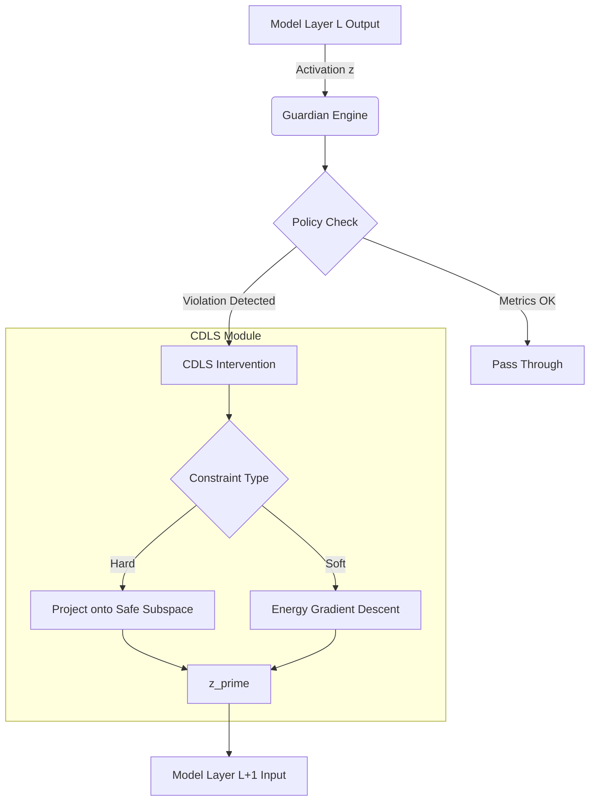

# CDLS Integration Analysis: NeuronMap

## 1. Zusammenfassung

Diese Analyse untersucht die Integration von **Constraint-Driven Latent Surgery (CDLS)** in das **NeuronMap**-Projekt. NeuronMap ist ein fortschrittliches Toolkit zur Analyse und Steuerung von neuronalen Netzwerkaktivierungen. Die bestehende Architektur, insbesondere das `Guardian`-Modul, bietet eine ideale Grundlage für CDLS.

**Ergebnis:** Die Integration ist **technisch sinnvoll, architektonisch kohärent und strategisch wertvoll**. CDLS erweitert die bestehenden Interventionsmöglichkeiten (Noise, Steering) um präzise, mathematisch garantierte Stabilitätsmechanismen.

---

## 2. Technische Analyse des Projekts

Das Projekt `NeuronMap` ist modular aufgebaut und trennt Analyse (`src/analysis`), Überwachung (`src/guardian`) und Visualisierung (`src/visualization`).

### Relevante Komponenten:
*   **`src/guardian/engine.py`**: Der zentrale Controller (`GuardianEngine`), der den Loop aus Introspektion (Probes), Entscheidung (Policies) und Intervention steuert.
*   **`src/guardian/interventions.py`**: Enthält die Primitiven für Eingriffe in den Latent Space (`InterventionManager`). Aktuell implementiert: `inject_noise`, `apply_steering_vector`, `ablate_neurons`.
*   **`src/guardian/policies.py`**: Die Entscheidungslogik (`BasePolicy`, `SwiReasoningPolicy`), die bestimmt, wann interveniert wird.

### Datenfluss:
1.  Modell-Forward-Pass.
2.  Hook an Layer $L$ extrahiert Aktivierung $z$.
3.  `GuardianEngine` erhält $z$.
4.  `Probes` berechnen Metriken (Entropie, etc.).
5.  `Policy` entscheidet über Aktion.
6.  `InterventionManager` modifiziert $z \to z'$.
7.  Modell setzt Forward-Pass mit $z'$ fort.

---

## 3. CDLS-Eignungsanalyse

CDLS passt hervorragend in die "Guardian"-Philosophie. Während aktuelle Methoden (Noise, Steering) eher "weiche" oder stochastische Eingriffe sind, bietet CDLS "harte" oder energetisch definierte Grenzen.

### Wo bringt CDLS Stabilität?
1.  **SwiReasoning (System 2 Thinking)**: Während der "latenten" Denkphasen kann das Modell in unsinnige Bereiche abdriften (Halluzinationen). CDLS kann den latenten Zustand auf den Manifold der "gültigen Denkprozesse" projizieren.
2.  **Safety Guardrails**: Verhindern, dass das Modell in "unsichere" Regionen des Latent Space eintritt (z.B. toxische Konzepte), indem eine Barriere (Energy Barrier) errichtet wird.
3.  **Konsistenz**: Erzwingen von logischen Constraints (z.B. "Wenn A aktiv ist, muss B inaktiv sein") direkt im Latent Space.

### Wo wäre CDLS kontraproduktiv?
*   In sehr frühen Schichten (Layer 0-5), wo die Repräsentationen noch sehr lokal/token-basiert sind und globale Constraints schwer zu definieren sind.
*   Wenn die Constraints falsch definiert sind (Manifold Mismatch), was die Kreativität oder Fähigkeit des Modells massiv einschränkt.

---

## 4. Konkrete mathematische Formulierungen

Wir definieren zwei Arten von CDLS-Operationen für NeuronMap:

### A. Harte Projektion (Subspace Projection)
Erzwingt, dass der Zustand $z$ in einem linearen Unterraum $S$ liegt (z.B. Orthogonalisierung zu einem "Verbotenen Vektor" $v_{ban}$).

$$ z' = z - \text{proj}_{v_{ban}}(z) = z - \frac{z \cdot v_{ban}}{\|v_{ban}\|^2} v_{ban} $$

Dies ist deterministisch und recheneffizient.

### B. Weiche Projektion (Energy-Based Manifold Correction)
Wir definieren eine Energiefunktion $E(z)$, die niedrig ist, wenn $z$ "plausibel" ist (z.B. Nähe zu Cluster-Zentren $C_k$ aus der Analyse-Phase).

$$ E(z) = \min_k \| z - C_k \|^2 $$

Update-Regel (Gradient Descent Schritt):

$$ z' = z - \eta \cdot \nabla_z E(z) $$

Dies zieht den Punkt $z$ sanft zurück in bekannte, sichere Regionen.

---

## 5. Architekturdiagramm (Integration)



---

## 6. Integration Guide

### Schritt 1: Erweiterung von `InterventionManager`
Datei: `src/guardian/interventions.py`

Wir fügen Methoden für `project_orthogonal` (Hard) und `optimize_latent` (Soft) hinzu.

### Schritt 2: Definition von Constraints
Wir benötigen eine Struktur, um Constraints zu speichern (z.B. gespeicherte Vektoren für "Refusal Directions" oder Cluster-Zentren). Dies könnte in `src/guardian/constraints.py` (neu) geschehen.

### Schritt 3: Neue Policy
Datei: `src/guardian/policies.py`

Eine `ConstraintPolicy`, die prüft, ob $z$ einen Constraint verletzt (z.B. Cosine-Similarity zu einem verbotenen Vektor > Threshold) und dann die CDLS-Intervention auslöst.

---

## 7. PyTorch-Beispielcode

Hier ist der Code für die Erweiterung von `src/guardian/interventions.py`:

```python
import torch
import torch.nn.functional as F
from typing import Optional, List

class CDLSInterventions:
    """
    Erweiterung für Constraint-Driven Latent Surgery.
    """
    
    def project_orthogonal(self, tensor: torch.Tensor, direction: torch.Tensor) -> torch.Tensor:
        """
        Harter Constraint: Entfernt die Komponente von 'tensor', die parallel zu 'direction' ist.
        Nützlich zum Entfernen spezifischer Konzepte (Concept Erasure).
        """
        if direction.device != tensor.device:
            direction = direction.to(tensor.device)
            
        # Normalisierung der Richtung
        direction = F.normalize(direction, p=2, dim=-1)
        
        # Projektion: (z . v) * v
        # Angenommen tensor ist [Batch, Seq, Dim] und direction ist [Dim]
        projection = torch.matmul(tensor, direction) # [Batch, Seq]
        projection = projection.unsqueeze(-1) * direction # [Batch, Seq, Dim]
        
        return tensor - projection

    def enforce_hypersphere(self, tensor: torch.Tensor, radius: float = 10.0) -> torch.Tensor:
        """
        Harter Constraint: Projiziert den Tensor auf eine Hypersphäre mit Radius R.
        Verhindert Exploding Activations.
        """
        norm = torch.norm(tensor, p=2, dim=-1, keepdim=True)
        # Nur skalieren, wenn Norm > Radius (oder immer, je nach Definition)
        mask = (norm > radius).float()
        scale = radius / (norm + 1e-6)
        
        return tensor * (1 - mask) + (tensor * scale) * mask

    def optimize_towards_prototype(self, 
                                 tensor: torch.Tensor, 
                                 prototypes: torch.Tensor, 
                                 step_size: float = 0.1, 
                                 steps: int = 5) -> torch.Tensor:
        """
        Weicher Constraint: Iterative Annäherung an den nächsten erlaubten Prototypen.
        prototypes: [Num_Prototypes, Dim]
        """
        z = tensor.clone().detach().requires_grad_(True)
        
        if prototypes.device != z.device:
            prototypes = prototypes.to(z.device)
            
        optimizer = torch.optim.SGD([z], lr=step_size)
        
        for _ in range(steps):
            optimizer.zero_grad()
            
            # Finde Abstand zum nächsten Prototypen
            # Distanzmatrix: [Batch, Seq, Num_Proto]
            dists = torch.cdist(z, prototypes) 
            min_dist, _ = torch.min(dists, dim=-1)
            
            loss = min_dist.mean()
            loss.backward()
            optimizer.step()
            
        return z.detach()
```

---

## 8. Testplan

1.  **Unit Tests**:
    *   Prüfen, ob `project_orthogonal` tatsächlich dazu führt, dass das Skalarprodukt mit dem Richtungsvektor 0 ist.
    *   Prüfen, ob `enforce_hypersphere` die Norm korrekt begrenzt.
2.  **Integration Tests**:
    *   Laden eines kleinen Modells (z.B. GPT-2).
    *   Definieren eines "Dummy"-Constraints (z.B. "Vermeide Vektor X").
    *   Inferenz laufen lassen und prüfen, ob der Output sich ändert und der Constraint im Latent Space eingehalten wird.
3.  **Qualitative Validierung**:
    *   Verwendung von `SwiReasoning`.
    *   Vergleich von Traces mit und ohne CDLS bei schwierigen Prompts.

---

## 9. Limitierungen & Risiken

*   **Performance**: Die iterative Optimierung (`optimize_towards_prototype`) ist teuer (mehrere Backward-Passes pro Token). Für Echtzeit-Anwendungen sollten nur analytische Projektionen (Harte Constraints) verwendet werden.
*   **Dimensionalität**: In hohen Dimensionen (4096+) ist die euklidische Distanz oft wenig aussagekräftig (Curse of Dimensionality). Cosine-Similarity ist oft robuster.
*   **Konflikte**: Wenn mehrere Constraints gleichzeitig aktiv sind, kann die Schnittmenge leer sein. Priorisierung oder Relaxierung ist notwendig.

---

## 10. Empfehlung

**GO.**

Die Integration von CDLS hebt `NeuronMap` von einem reinen Analyse-Tool auf ein aktives **Control-Framework** ("AI Safety Engineering Tool"). Der Aufwand ist moderat (ca. 2-3 Tage Entwicklungszeit), der Nutzen für Forschung und Sicherheit ist hoch.

**Nächster Schritt:** Implementierung der `CDLSInterventions` Klasse in `src/guardian/interventions.py`.
